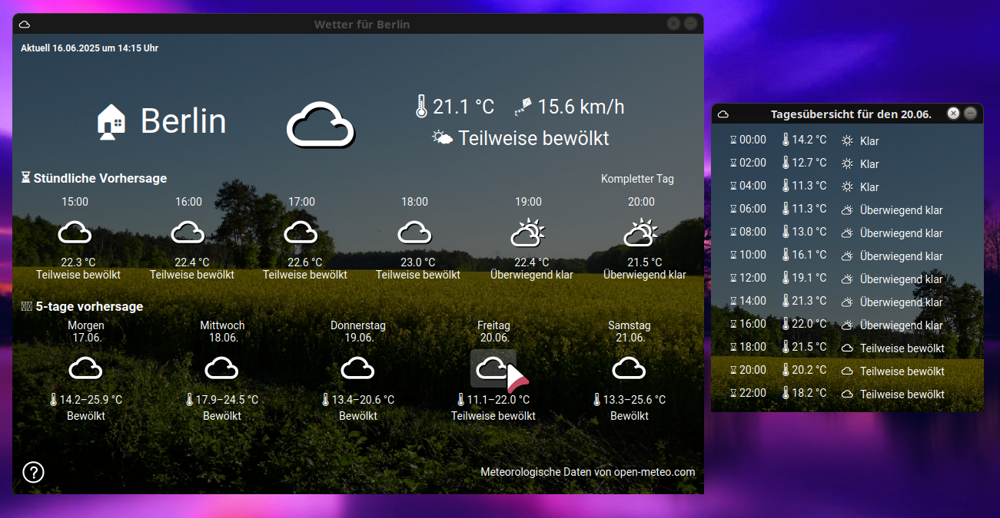

# x-live-wetter

[DE] Wettervorhersage mit Tray Icon 

Die meteorologischen Daten werden per API von open-meteo.com abgerufen.
Die App startet als Tray-Icon und kann über die Taskleiste geöffnet bzw. der Wetterstandort geändert werden.

[EN] Weather forecast with tray icon

The app starts as a tray icon and can be opened or the weather location changed via the taskbar.

-----

